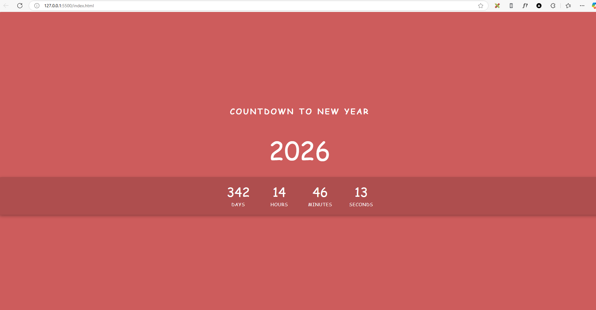

# New Year Countdown

A simple and visually appealing countdown timer that displays the time remaining until the next New Year. This project is built using **HTML**, **CSS**, and **JavaScript**.



---

## Features

- **Dynamic Countdown**: Displays days, hours, minutes, and seconds until the next New Year.
- **Automatic Year Update**: Automatically updates the target year and restarts the countdown after the current year ends.
- **Celebration Animation**: Displays a "Happy New Year!" message with a festive animation when the countdown reaches zero.
- **Responsive Design**: Works seamlessly on all screen sizes (desktop, tablet, and mobile).

---

## How It Works

1. The application calculates the time remaining until the next New Year (`January 1` of the following year).
2. The countdown updates every second, displaying the remaining days, hours, minutes, and seconds.
3. When the countdown reaches zero:
   - A "Happy New Year!" message is displayed with a celebration animation.
   - The animation runs for **30 minutes** and then stops.
   - The countdown automatically restarts for the next year.

---

## Technologies Used

- **HTML**: Structure of the application.
- **CSS**: Styling and animations.
- **JavaScript**: Logic for the countdown and dynamic updates.

---

## Installation

To run this project locally, follow these steps:

1. **Clone the repository**:
   ```bash
   git clone git@github.com:belviPouadjeu/JS-01-newyearcountdown.git
   ```

2. **Navigate to the project folder:**:
```bash
cd new-year-countdown
```

3. **Navigate to the project folder:**:

    - Open the index.html file in your browser.


## Usage
1. Open the `index.html` file in your browser.

2. The countdown will automatically start and display the time remaining until the next New Year.

3. When the countdown reaches zero, a "Happy New Year!" message will appear with a festive animation.

## Skills Learned

While building this project, I learned and practiced the following skills:

- **HTML**:
  - Structuring content using semantic HTML elements.
  - Creating a clean and accessible layout.

- **CSS**:
  - Styling elements with custom fonts, colors, and animations.
  - Using Flexbox for responsive and centered layouts.
  - Creating keyframe animations for dynamic effects.

- **JavaScript**:
  - Working with the `Date` object to calculate time differences.
  - Dynamically updating the DOM to display the countdown.
  - Using `setInterval` and `setTimeout` for real-time updates and delays.
  - Handling edge cases (e.g., negative time values) and restarting the countdown.

- **Git & GitHub**:
  - Version control using Git for tracking changes.
  - Pushing code to GitHub and managing repositories.
  - Writing a professional README file in Markdown.

- **Problem Solving**:
  - Debugging and fixing issues in the countdown logic.
  - Implementing dynamic year updates and celebration animations.

- **Responsive Design**:
  - Ensuring the application works seamlessly on all screen sizes (desktop, tablet, and mobile).

- **Project Management**:
  - Breaking down the project into smaller tasks and implementing them step by step.
  - Documenting the project and writing clear, maintainable code.

## Contributing
Contributions are welcome! If you'd like to contribute to this project, follow these steps:

1. Fork the repository.

2. Create a new branch (`git checkout -b feature/YourFeature`).

3. Commit your changes (`git commit -m 'Add some feature`').

4. Push to the branch (`git push origin feature/YourFeature`).

5. Open a pull request.

